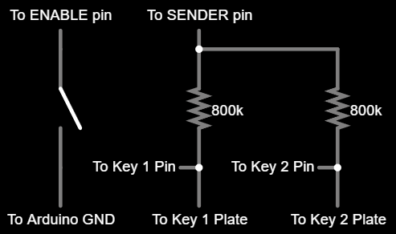

# Subayai
⚡A hopefully speedy touch keypad for rhythm gaming

## Why
I wanted a touch keypad and I didn't have the correct Arduino. So I made one for Uno.

## Flashing
You'll need:
- An Arduino Uno.
- The legacy Arduino IDE.
- [HoodLoader2](https://github.com/NicoHood/HoodLoader2)
- [HID-Project](https://github.com/NicoHood/HID)

After installing those:
- Open the sketch with the legacy IDE.
- Edit pins and modify keys in `Board.h` if desired.
- Flash once for `HoodLoader2 16u2`.
- Flash again for `HoodLoader2 Uno`.

The correct code is chosen automatically based on the selected board.

## Wiring
While simple, it doesn't scale too well for large key counts. As I don't need those, I'm not worried about it right now.



To add a new key, simply add a new lane to the right. There's a hard limit at sixteen keys. Other resistor values between 400k and 1M should work, would advise against mixing values.

## Configuration
Configuration is done through the CLI. It can be installed by running:
```bash
pip install git+https://github.com/Deltara3/Subayai.git#subdirectory=src
```

To provide a quick rundown of the commands:
- `dump` - Prints your current config.
- `update` - Updates specific values or your entire config.
- `reset` - Resets your entire config, use with caution.

> [!IMPORTANT]
> `--key-code`, `--threshold`, and `--discharge-delay` expect a value in the form of `k=v` where `k` is the key number, and `v` is the value.

And the values:
| Value           | Description                                                                                                             |
| :-------------- | :---------------------------------------------------------------------------------------------------------------------- |
| Key Code        | Keyboard scan code for a key.                                                                                           |
| Threshold       | How sensitive a key is, in cycles. Lower without ghost taps is better.                                                  |
| Discharge Delay | How long, in microseconds, the sensor will take to wait for a plate to discharge. Lower without ghost taps is better.   |
| Debounce Delay  | How long, in microseconds, the sensor will need to register another key down event. Lower without ghost taps is better. |


Now `--help` is your friend.

## License
This project is licensed under the MIT License.
